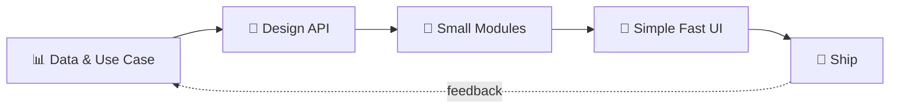

<!-- ═══════════════ HEADER ═══════════════ -->
<div align="center">


<a href="https://github.com/Mohamedelsaid584">
  
</a>

<br/>


</div>

---

## 👨‍💻 &nbsp;About Me

```js
const mohamed = {
  role: "Full Stack Developer",
  focus: ["Backend APIs", "Clean Architecture", "Mobile + Web"],
  currentlyBuilding: "Education & rental management platforms",
  philosophy: "Small modules. Clear code. Ship it.",
  funFact: "I learn by building, not by watching tutorials ⚡",
};
```

---

## 🛠️ &nbsp;Tech Arsenal

<div align="center">

**Backend**


**Frontend & Mobile**


**Databases & Tools**


</div>

---

## 🚀 &nbsp;What I Build

| 🎓 Education | 🏠 Real Estate | 📦 Business | ⚙️ Backend |
|:--|:--|:--|:--|
| Learning management platforms | Student housing systems | Inventory tracking | Auth & JWT APIs |
| Course & progress tracking | Rental management | Expense tools | Reporting engines |
| Admin dashboards | Booking flows | Full stack dashboards | REST architectures |

---

## ⚡ &nbsp;How I Work



---

## 📊 &nbsp;GitHub Stats

<div align="center">


<br/>


<br/>


</div>

---

## 📈 &nbsp;Contribution Graph

<div align="center">

</div>

---

## 🤝 &nbsp;Let's Connect

<div align="center">

<a href="https://github.com/Mohamedelsaid584"></a>
<a href="https://linkedin.com/in/YOUR-LINKEDIN"></a>
<a href="mailto:YOURMAIL@example.com"></a>

<br/><br/>


</div>
